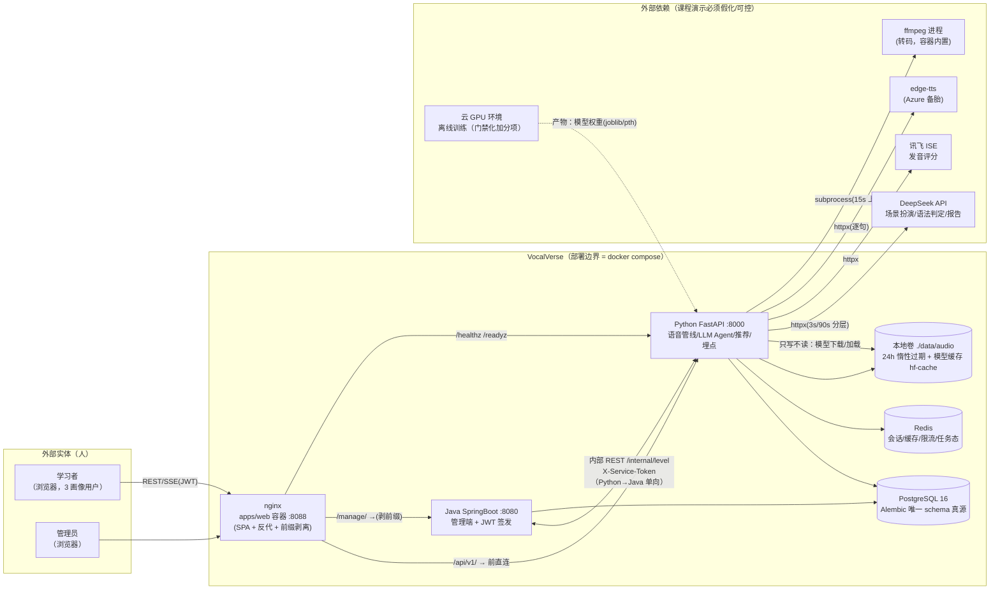
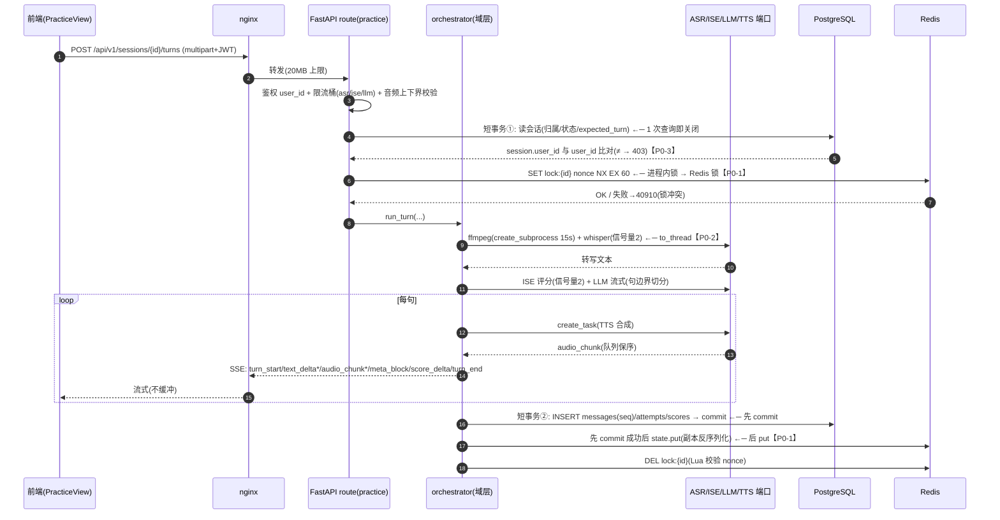
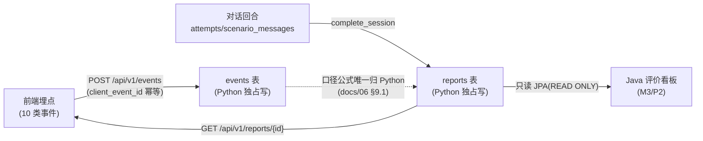
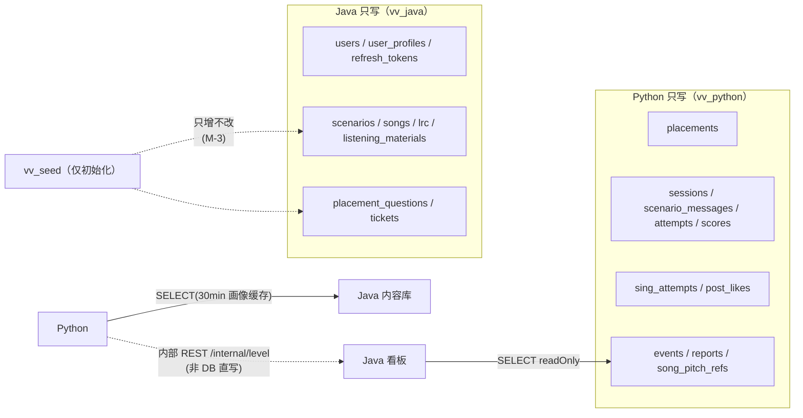

# 20 · 系统架构设计说明书

> **状态**：草案（09/09 设计评审稿）。**作者**：A（架构+后端）。
> **定位**：《系统设计说明书》架构分册，覆盖 09/07 分工任务「系统架构设计（分层、服务边界、写方唯一性约束、数据流图）」。
> **权威关系**：本文档**不取代 ADR 权威**（`docs/06-技术框架决策.md`）；与 docs/06 冲突处以 docs/06 为准。数据库细节以 `docs/10-数据库设计.md` 为准；现状缺陷证据以 `docs/19-架构与实现模式评审报告.md`（2026-09-01 合入后评审）为准。接口契约详见 `docs/21-接口设计说明书.md`（同日成稿）。
> **口径约定**：本文区分三种状态——【已实现】= 9/7 复核代码属实；【设计承诺】= 本文档规定的目标态（尚未落地，待 9/9 评审通过后进入实现）；【现状违例】= 与本文档设计不符且需整改。凡【设计承诺】与 docs/19 P0/P1 对应处，均标注证据编号（P0-x / P1-x）。

---

## 1. 设计目标与约束

### 1.1 目标

1. **热路径最小延迟**：语音热路径（录音→ASR→评分→LLM→TTS→SSE）前端直连 Python，首声反馈目标 3~5s（短轮次）/ 5~8s（≤30s 演示录音），口径与 docs/06 §8「延迟口径」一致。
2. **边界可守护**：服务边界、表级单写方不仅写进文档，还要有代码/DB 层守护机制（对应 docs/19 P0-7「单写方是荣誉制约定」的整改）。
3. **可扩充但不超配**：满足 100~500 DAU 的课程演示规模；横向扩容/多副本能力通过 Redis 化会话态预留（对应 P0-1），任务队列等重型设施不引入（P2 阶段再议）。
4. **契约单一真源**：OpenAPI 快照 + `docs/api/` + CI 三关卡（详见 docs/21），内部 REST 一并纳入。

### 1.2 约束（继承 ADR）

| 约束 | 出处 |
|---|---|
| 栈：Vue3+TS+Vite6 / FastAPI+SQLAlchemy2+Alembic / Spring Boot 3.3 + Java 21 / PG16 / Redis | docs/06 §3 |
| Alembic 唯一 schema 真源；Java `ddl-auto=none`；约束/FK/索引只建在 Alembic | docs/06 §10、docs/10 §1-P1 |
| Java 严禁进入语音/SSE/LLM 热路径；Python 不做管理端 CRUD、不签发 JWT | docs/06 §1 |
| 语音热路径前端直连 Python（不经 Java） | docs/06 §1 |
| `uvicorn --workers 1` 显式声明；whisper/ISE 并发信号量 2；>10ms CPU 工作进 `to_thread` | docs/06 §8 |
| v0 录完再传（非流式分片）；下行 SSE，不做 WebSocket | docs/06 §8 |
| 单次语音 ≤60s、唱歌 ≤180s、体积 ≤20MB | docs/06 §8 |
| 合规：录音 24h 过期、只存评分/转写/元数据、demo 不采真实数据 | docs/06 §9.7 |

### 1.3 非目标（本期明确不做，评审不扣分）

- 原生 App / WebSocket 双向流 / 双人实时对练：均已在 docs/06 拍板不做；
- 消息队列（Celery/RQ/arq）：本期不引入（docs/19 §7 判定「建议级别」，P2 阶段再议）；
- 多副本水平扩容、K8s：超出课程演示范围，但设计上保证「换 Redis 后端即可扩」不返工（见 4.4 / 5.2）。

---

## 2. 总体架构与分层

### 2.1 系统上下文（DFD-1）



要点：

- **读侧/写侧分离**：`reports` 的写唯一归 Python，Java 管理端只读（docs/10 §3-P9）；
- **外部依赖全部有 Fake 实现**（`settings.testing` + `audio/base.py` 端口抽象），CI 零真实密钥（docs/06 §5）；
- **ffmpeg 是唯一遗留的同步进程依赖**，目标态必须走 `asyncio.create_subprocess_exec` + 15s 超时（P0-2 整改项）。

### 2.2 五层划分

| 层 | 组成 | 职责 | 关键约束 |
|---|---|---|---|
| L1 表现层 | 浏览器（Vue3 SPA：views / components / composables） | 页面、录音（MediaRecorder）、SSE 消费、音频队列播放、埋点上报、可视化 | 不直连外部 AI 服务；不持有业务状态真源 |
| L2 接入层 | nginx（容器）/ Vite dev 代理 | SPA 静态资源、反向代理、前缀剥离（`/manage` → Java）、SSE 不缓冲、20MB 上传上限、X-Request-Id 透传 | 两处代理语义必须同步（docs/06 §2.1 注记 3）；`/manage/internal/` 必须对外 404（P0-9 整改项） |
| L3 服务层 | Python FastAPI / Java Spring Boot | 见 §3.1 职责边界表 | 单向依赖；Java 不进热路径 |
| L4 数据层 | PostgreSQL / Redis / 本地音频卷 | schema 真源、会话/缓存/限流、音频对象（24h） | Alembic 唯一；Redis 不存业务主数据；音频存储预留 `AudioStore` 端口（P2-1） |
| L5 外部依赖层 | DeepSeek / 讯飞 / edge-tts / ffmpeg / 云 GPU | 模型与算法能力 | 端口抽象 + Fake；熔断/降级矩阵（P1-3）；GPU 只离线 |

### 2.3 应用内分层

#### Python（服务核心，约 6 个包内层）

```
route 层         app/api/routes/*          HTTP 编排：鉴权/限流依赖、envelope 包装、SSE 流转换
   ↓
service 层       app/practice/orchestrator.py（回合状态机）
                 app/practice/service.py（会话/报告/聚合）
                 app/practice/state.py（StateStore 端口 + 内存实现）
   ↓
domain 层        app/practice/corpus.py（语言点匹配）、评分/指标口径（docs/06 §9 唯一实现处）
   ↓
port 层          app/audio/base.py（ASRClient/TTSClient/ScorerClient/LLMClient 四个 ABC）
                 AudioStore（P2-1 预留：save/load/delete_url，当前直接文件实现）
   ↓
adapter 层       faster-whisper / Silero VAD / edge-tts+Azure / 讯飞 ISE / DeepSeek(httpx) / ffmpeg
                 Fake 实现（settings.testing 注入）
   ↓
infra 层         app/db（session factory + UoW）、app/core（config/trace/redis_client/ratelimit）
```

分层规则（评审打回项）：

- **route 不直接 new DB Session**：现状有 12 处 `get_session_factory()()` 散落（docs/19 §7「UoW 建议」），目标态收敛为 `with uow() as db:` 短事务上下文（P0-2 整改项）；
- **orchestrator 只经 port 调外部客户端**，禁止 import 具体 SDK；
- **状态访问收敛到 `app/practice/state.py` 唯一入口**（`get_state_store()`），禁止 route 直接操作 `SessionState` 可变对象；读时反序列化副本、回合结束「先 DB commit 后 state put」（P0-1 整改项）；
- **指标口径唯一实现归 Python**（docs/10 §3.1-P9），Java 不复制公式。

#### Java（薄管理端）

```
controller 层     auth / user(internal) / 场景·歌曲·LRC·题库·工单(M3) / 看板(只读 reports)
   ↓
service 层        （薄：现状控制器直连 Repository，M3 增规则时提取，禁写指标口径）
   ↓
repository 层     JPA 只读映射（ddl-auto=none；@Transactional(readOnly=true) 用于读方）
   ↓
entity 层         纯映射，不承载业务规则；JSONB 用 JsonNode 映射（docs/10 §5.2）
```

#### 前端（Vue3）

```
views（页面） → stores（Pinia：auth / 会话） → api/（client.ts 基类 + 域模块 + generated/*.d.ts 类型）
                                                   ↓
                                             sdk/（recorder.ts / sse.ts / audio 队列）
```

- `api/generated/*.d.ts` 由 OpenAPI 快照构建期生成（`pnpm gen:api`），手写 DTO 只允许落在**契约之外**（内部 REST 不用生成，改手写 + 契约登记，见 docs/21 §5）；
- 录音/SSE/播放封装在 SDK 层，业务组件不直接碰 `MediaRecorder` 与 `EventSource` 解析（现状 `sse.ts` 已如此，保持）。

### 2.4 依赖方向与禁止规则（硬约束）

| 规则 | 违反即评审打回 |
|---|---|
| R1 前端 API 只走网关（nginx/vite 代理），**不直连 8000/8080 以外端口**；外部 AI 服务只能由 Python 调 | 前端页面内出现 `https://api.deepseek.com` |
| R2 Java **不进口**语音/LLM/SSE 相关依赖；`/internal/**` 只走服务令牌 | Java 出现 `whisper`/`edge-tts`/`openai`/`sse` 依赖 |
| R3 跨服务 DB 直写禁止（P8）；跨服务写一律经内部 REST 委托 | Python 代码 `session.add(Scenario(...))`（seed 除外，见 4.4 M-3） |
| R4 Python 不签发 JWT、不校验 refresh；Java 不做指标口径计算 | Java 出现 CTR/完成率等公式 |
| R5 服务内部单向依赖：route→service→port→adapter，**禁止反向 import**（adapter import route 等） | 反向 import 出现即在 review 指出 |
| R6 SSE/流式端点不得持有同步 DB 连接跨事件循环边界（短事务） | `orchestrator` 内 `get_session_factory()()` 后跨 `await` 持连接 |

---

## 3. 服务边界

### 3.1 职责边界表（继承 docs/06 §1，增补边界判据）

| 服务 | 职责 | 明确不做 | 依赖方向 |
|---|---|---|---|
| Python (FastAPI) | ASR/TTS/发音评分/唱歌评分/LLM 场景扮演 Agent/推荐与水平预测/埋点落库/指标聚合（reports） | 管理端 CRUD；JWT 签发；refresh 校验；DDL | → PG（自己表）、Redis、外部 AI；→ Java（仅 `/internal/level` 回写，非热路径） |
| Java (Spring Boot) | 用户管理、场景/歌曲/LRC/题库/听力素材 CRUD、工单、JWT 签发、（P2）评价看板只读 | **语音/SSE/LLM 热路径**；指标口径公式；DDL（`ddl-auto=none`）；刷新后写 Python 表 | → PG（自己表）；← Python 内部 REST |
| 前端 (Vue3) | 页面、录音、SSE 消费、音频队列、埋点上报、报表可视化 | 原生 App；业务状态真源；直连外部 AI | → 网关（唯一出口） |

**边界判据**（新功能落位用）：*该能力是否消耗外部 AI 配额？* 是 → Python；*是否修改账户/内容库/工单且无音频？* 是 → Java；*指标口径定义在哪边？* → Python，Java 只读；*需要长连接/流？* → Python。

### 3.2 通信与鉴权边界

| 通道 | 方向 | 协议 | 鉴权 | 超时/限流 |
|---|---|---|---|---|
| 业务/登录 API | 前端→Java | REST（JSON envelope，网关 `/manage/` 剥前缀） | Bearer access JWT（HS256，15min）；refresh 走 httpOnly cookie（7d） | 常规 3s |
| 语音/LLM 热路径 | 前端→Python | REST + SSE（`text/event-stream`，心跳 15s【设计承诺】） | Bearer access JWT（Python 共享 secret 验签） | 上传 ≤20MB；ASR/ISE/LLM 30 次/用户/时、TTS 60 次/用户/时、登录 5 次/分/IP |
| 内部委托 | Python→Java | REST `POST /internal/level`（仅此一条，见 docs/21 §5） | `X-Service-Token` 头，服务内网直连（**不过网关**） | 3s 超时；失败不阻塞入学测试（日志告警 + `placements` 为校对源） |
| 健康检查 | 网关/编排→两端 | GET `/healthz`（存活）`/readyz`（就绪：PG `SELECT 1` + Redis `PING`，`degraded` 语义）【readyz 当前恒真，P1-6 整改项】 | 无 | 1s |

**Token 边界**：access/refresh 由 Java 签发；Python 只验 access 不查 refresh；JWT secret 与 service token **严禁默认值入库**（P0-9 整改项：缺失即启动失败）。

### 3.3 网关边界（nginx :8088）

| location | 目标 | 说明 |
|---|---|---|
| `/api/v1/` | python-api:8000 | SSE：`proxy_buffering off`、`Connection ''`、`proxy_read_timeout 300s`（配合服务端 15s 心跳后可在 90s 量级收紧）；`client_max_body_size 20m` |
| `/manage/` | java-api:8080/（**尾斜杠 = 剥前缀**） | 与 vite.config.ts rewrite 语义一致，两处必须同步改 |
| `/manage/internal/` | **阻断（目标态）** | 内部接口不过网关（P0-9 整改项；当前可直接 `POST /manage/internal/level`） |
| `/healthz` `/readyz` | python-api:8000 | - |

### 3.4 进程/并发边界（服务端）

| 项 | 决策 | 目标态 |
|---|---|---|
| Python worker | `--workers 1`（whisper 自带 C++ 线程池，多 worker 收益为负 + 每进程 ~500MB 模型） | 不变；横向扩容走「多实例 + Redis 会话态」【设计承诺，P0-1】 |
| 模型侧并发闸门 | whisper 信号量 2、ISE 信号量 2（全仓当前无 `Semaphore`，P1-4 整改项） | `app/audio/base.py` 两个模块级 `asyncio.Semaphore` |
| CPU 工作 | >10ms 必须 `to_thread`；ffmpeg 走 `asyncio.create_subprocess_exec` + `wait_for(15s)`（当前 sync `subprocess.run` 无超时，P0-2） | 事件循环永不被单次调用阻塞 |
| DB 连接 | 池 20 + overflow 10 + `pool_timeout=5s`（当前默认 5+10 且回合内长持有，P0-2）；**回合中途不持连接** | 短事务 UoW |
| Redis | 会话 `session:{id}` TTL 30min、锁 `SET NX EX 60`、限流计数、缓存 TTL 5min、唱歌任务态【设计承诺，P0-1】 | 内存实现保留作降级与单测桩 |

---

## 4. 写方唯一性约束（Single Writer）

### 4.1 表级单写方矩阵（19 表，继承 docs/10 §3；9/8 新增表同规则登记）

| 模块 | 表 | 写方 | 读方 | 现状写方代码 | 备注 |
|---|---|---|---|---|---|
| 账户 | users | **Java** | Py | Java（注册） | seed 豁免仅 vv_seed |
| 账户 | user_profiles | **Java** | Py | Java（注册建档；`/internal/level` 回写） | Python 只读档位/年龄组 |
| 账户 | placements | **Python** | Java | Python（finalize） | Java 侧读作校对源 |
| 账户 | refresh_tokens | **Java** | Java | Java（rotation） | 只存哈希 |
| 内容 | scenarios | **Java** | Py | **Python（seed.py）⚠ 违例** | 见 4.5 |
| 内容 | songs | **Java** | Py | 无 | M3 落地 |
| 内容 | lrc | **Java** | Py | 无 | M3 落地 |
| 内容 | listening_materials | **Java** | Py | 无 | M3 落地 |
| 内容 | song_pitch_refs | **Python** | Py | 无 | 次生表，`lrc_id` CASCADE（docs/10 §3.2-2） |
| 内容 | placement_questions | **Java** | Py | **Python（seed.py）⚠ 违例** | 见 4.5 |
| 练习 | sessions | **Python** | Java | Python | Java 只读事务 |
| 练习 | scenario_messages | **Python** | Java | Python | 只 INSERT 事件流（seq 唯一） |
| 练习 | attempts | **Python** | Java | Python | - |
| 练习 | scores | **Python** | Py | 无 | 音素级明细 |
| 练习 | sing_attempts | **Python** | Java | 无 | M3 |
| 练习 | post_likes | **Python** | Java | 无 | M3 社区 |
| 分析 | events | **Python** | Java | Python | `client_event_id` 幂等 |
| 分析 | reports | **Python** | Java | Python | **upsert 语义（P0-8 整改）**；看板唯一数据源 |
| 支持 | tickets | **Java** | Py | 无 | M3 工单 |

### 4.2 三个交叉写点的规则（继承 docs/10 §3.2）

1. **入学档位回写**：Python 写 `placements` → 调 `POST /internal/level` → Java 写 `user_profiles`；失败不阻塞、告警、`placements` 作校对源；**禁止 Python 直写 user_profiles**。
2. **参考旋律提取**：`song_pitch_refs`（Python 拥有）以 `lrc_id` 外键 + CASCADE 挂接 Java 内容库；LRC 整首重写 → 旧行级联删除 → Python 离线检测重提取。
3. **报表流**：Python 独占 `events` 与 `reports`；Java 看板只读（口径公式唯一归 Python）。

### 4.3 写方义务细则（继承 docs/10 §5）

- `updated_at` 由写方维护（Python `onupdate` / Java `@LastModifiedDate` 或显式赋值）；
- JSONB 先序列化再落库；Java 映射 `JsonNode`，不假设表结构；
- 事件幂等：`client_event_id` 唯一索引兜底，重复到达返回 ok；
- 读方禁止为绕过写方做落库副本（出现即违反 P8 打回）。

### 4.4 守护机制设计（本节是 09/07 新增，目标把「荣誉制」变「机制制」）

**M-1 DB 角色与按表授权（治本）**

- 新建三个运行时角色：`vv_python`、`vv_java`、`vv_seed`；DDL 仍由管理员（migrate 服务）执行；
- 授权矩阵：所有表 `GRANT SELECT` 给三角色；写权限严格按 4.1 矩阵给 `vv_python` / `vv_java`；`vv_seed` 仅获**内容库与题库表**的 INSERT/UPDATE（种子初始化专用，见 M-3）；
- 落地：`infra/pg/init-roles.sh`（挂 `docker-entrypoint-initdb.d`，PG 镜像首次初始化执行；密码经环境变量注入 **不进仓库**）+ `docker-compose.yml` 中各服务 `APP_DATABASE_URL`/`DB_URL` 换角色连接串；Alembic 迁移本身仍用管理员连接（与 9/8 迁移 0003 同批落地）；
- 收益：写越权从「会发生的错误」变成「数据库拒绝的 42501」，且 **Java 侧漏写 DDL/换表名立刻暴露**；
- 代价：约 0.5 人天（docs/19 P0-7 建议方案）。

**M-2 CI 静态探针（治标，先落地）**

- `scripts/check-single-writer.ps1`：AST/正则扫描 `services/python/app`（种子文件豁免清单除外），凡 import 了 **Java 拥有表模型**（scenarios/songs/lrc/listening_materials/placement_questions/tickets/users/user_profiles/refresh_tokens）且调用 `Session.add / add_all / delete / update / bulk_* / execute(insert)` 即失败；
- 接入 `python-ci.yml` 独立 step（≈30 行脚本，2 小时，docs/19 P0-7 次选方案）；
- 同一探针扩展 Java 侧镜像检查（Java 代码写 Python 拥有表）需解析 Spring Data 方法名，成本高，**以 M-1 代替**。

**M-3 seed 豁免条款（明确边界，消除「可写可不写」）**

- seed 是**开发期数据初始化器**，与运行时单写方契约并存（docs/10 §7.3 待拍板项的结论：以 `vv_seed` 角色许可成文）；
- seed 语义收紧为：**只增不改**（存在即跳过；INSERT...ON CONFLICT DO NOTHING），保证管理员编辑不被初始化器覆盖（docs/19 P0-7 后果 2 的消除）；
- 稳定业务键：`scenarios` 建议增加 `slug` 唯一键（9/8 迁移 0003 一并定），替代当前 `title` 查重——title 会被管理端编辑，改名即误判「不存在→插入重复」；
- 种子只允许写：内容库表 + 题库表 + 演示账号（users 的账号种子本就有争议，按 docs/10 §7.3 维持「账号不行，走 Java `CommandLineRunner`」的默认，需组长两次拍板确认一次）。

**M-4 评审打回规则**

- 任何 PR 出现「读方写入自己拥有的表以外」「绕过内部 REST 跨服务写」「seed 覆盖既有行」之一 → 评审直接打回（与 docs/10 §2-P8 同语义，写入本说明书使其成为评审 checklist，见 §7）。

### 4.5 现状违例与整改路径

| 违例 | 证据 | 整改 |
|---|---|---|
| `seed.py` 用 Python 写 `scenarios`/`placement_questions` | `app/db/seed.py` L71-101；compose migrate 服务每次 `up` 执行 | M-3（改只增不改 + slug 键）→ 由 `vv_seed` 角色执行；M-2 探针豁免清单仅列 seed 文件 |
| 两服务共用同一 DB 账号（`POSTGRES_USER`） | docker-compose L45/L90-94 | M-1 角色，compose 连接串拆分 |
| 无任何机制守护 | 无 DB 角色、无 CI 探针 | M-1（随 0003）+ M-2（9/10 前） |
| ~~Java 侧没有任何场景/歌曲/工单实体~~ | ~~只见 auth 域代码~~ | ✅ **已整改（2026-09-07 提前落地，commit c8cbba2）**：管理端最小集实现（用户管理/内容库 CRUD + LRC 整首重写/题库版本化/工单状态机），admin 角色 = JWT role claim + `/api/v1/admin/**`；M-1 角色授权随 0003 落到 `vv_java` |

---

## 5. 数据流图

### 5.1 系统上下文 DFD（见 2.1，此处为图号引用）

### 5.2 一次对话回合（目标态时序，含 P0 整改点）



现状差异标注：`DB 短事务①②`、`Redis 锁`、`ffmpeg 异步化`、`句边界切分` 均为【设计承诺】；当前实现是进程内 dict 状态 + 同步 Session 横跨整个 SSE（证据：docs/19 §1.2 时序 L76-87、P0-1/P0-2/P0-5）。

### 5.3 报表数据流（events → reports → Java 看板）



要点：`reports` 为预计算读模型（CQRS 的轻量形态，不引入完整 CQRS，docs/19 §7 判定）；重复计算 = **upsert**（P0-8 整改：当前 `INSERT` 撞唯一键返 500）。

### 5.4 写方边界图（权限视角）



---

## 6. 关键设计决策与现状差异（评审重点）

> 现状复核日：2026-09-07（代码实测，未采信文档声称）。P0 证据细节见 docs/19（引文含行号），此处只登记「设计 → 现状 → 目标态 → 排期」。

| # | 设计决策（本文档生效项） | 现状（9/7 复核） | 目标态 | 排期 |
|---|---|---|---|---|
| D1 | 会话状态真源 = DB 事件流（scenario_messages），运行时快照 = Redis（`session:{id}` TTL 30min）+ 分布式锁 | ✅ 状态机/seq 在 `state.py` 进程内 dict（P0-1） | Redis 后端 + 读时副本 + 先 commit 后 put | 9/10 起，0.5~1 人天 |
| D2 | 回合为短事务，SSE 内不持同步连接；ffmpeg/whisper 异步化 + 信号量 + 分层超时 | ❌ 同步 Session 横跨回合、`subprocess.run` 无超时、无信号量、无熔断（P0-2/P1-3/P1-4） | `uow` 短事务 + `create_subprocess_exec(15s)` + `Semaphore(2)` ×2 | 9/10~9/11 集中返工，1~1.5 人天 |
| D3 | 语音/LLM 裸端点统一鉴权 + 限流（含 defense 生成走 llm 桶） | ❌ `/asr /score /tts /llm/chat` 无鉴权无限流（P0-4） | `Depends(get_current_user_id)` + 对应桶 | 9/10，0.5 人天 |
| D4 | 越权校验三处修（回合归属/报告归属/收尾归属） | ❌ `get_report`/`complete` 无归属过滤，`run_turn` 不比对（P0-3） | 与 defense 同款 `!= 404` 校验 + 越权测试 | 9/10，0.5 人天 |
| D5 | 报告重复收尾幂等（upsert） | ❌ 唯一键冲突 500（P0-8） | `ON CONFLICT DO UPDATE` + completed 短路 | 9/10，2 小时 |
| D6 | 内部 REST 契约化（`/internal/level` 入 docs/21 §5）+ 字段名统一 `userId` | ❌ Python 发 `user_id`、Java 收 `userId` → 400 被静默吞（P0-6） | 契约文件 + 失败可见（`raise_for_status` + 日志）+ 双侧契约测试 | 9/10，半天 |
| D7 | 密钥无默认值（fail fast）+ 网关阻断 `/manage/internal/` | ❌ 默认 secret/service-token 入库且经网关可达（P0-9） | 配置缺失即启动失败 + nginx 404 段 | 9/10，2 小时 |
| D8 | 流式首声目标 3~5s（LLM 流内句边界切分 + 并发 TTS 队列 + 开场预合成） | ❌ LLM 全文完成后才串行 TTS（P0-5，首声 6~7.6s） | `asyncio.Queue` 保序 + 预合成 | 9/11，1 人天 |
| D9 | 写方唯一性守护机制（M-1~M-4） | ❌ 荣誉制（P0-7） | 角色 + 探针 + 种子条款 | M-2 探针 9/10；M-1 随 0003（9/15） |
| D10 | `/readyz` 真实探测（PG SELECT + Redis PING → degraded） | ❌ 恒真（P1-6） | 1s 超时探测 | 9/10，2 小时 |
| D11 | 音频回放鉴权与 `<audio>` 兼容：签名 URL 或 Blob | ❌ 鉴权头与 `<audio>` 物理不兼容（P1-1） | 签名 URL（服务端 25 行） | 9/11 |
| D12 | 音频落盘在状态校验**之后**；清理任务化 | ❌ 409/404 也留孤儿文件、mtime 共享误删（P1-2） | 落盘后移 + `AudioStore` 端口 + 小时级清理 | 9/10~9/11 |
| D13 | 指标口径落库修正（user_turn_count、救援轮从分子+分母剔除） | ❌ 完成率/互动率数据层错误（P1-7） | `complete_session` 补写 + 口径单测 | 9/11 |
| D14 | 会话恢复端点（`turn_end` 回带服务端权威 `next_expected_turn`；`GET /sessions/{id}`） | ❌ 双端状态机错位无恢复（P2-4） | 服务端唯一真源 | 9/11，30 分钟 |

**评审结论口径**：9/9 评审通过 = 本说明书设计承诺全部登记 + 9/10~9/11 返工清单确认承接人；D1/D2/D8 是高危项（演示成败关键）。

---

## 7. 设计评审检查表（DoD）

| 检查项 | 依据 | 通过标准 |
|---|---|---|
| 分层单向依赖 | §2.3/§2.4 | 无反向 import；route 不 new Session |
| 热路径直连 | §2.1/§3.2 | 前端→Python 不经 Java；Java 无语音依赖 |
| 单写方矩阵 | §4.1 | 19 表每表恰好一个写方；9/8 新增表当日登记进 docs/10 |
| 守护机制 | §4.4 | M-1~M-4 至少两项进入实施排期；评审意见无「仅文档」遗留 |
| DFD 与实现一致 | §5 | 图内每个节点/边都有代码或设计承诺对应；不一致点全部进 §6 表 |
| 接口契约 | docs/21 | 双快照对账、内部 REST 已登记、整改项有 owner |
| 合规 | docs/06 §9.7 | 24h 过期、只存评分/转写/元数据、密钥无默认值（D7） |
